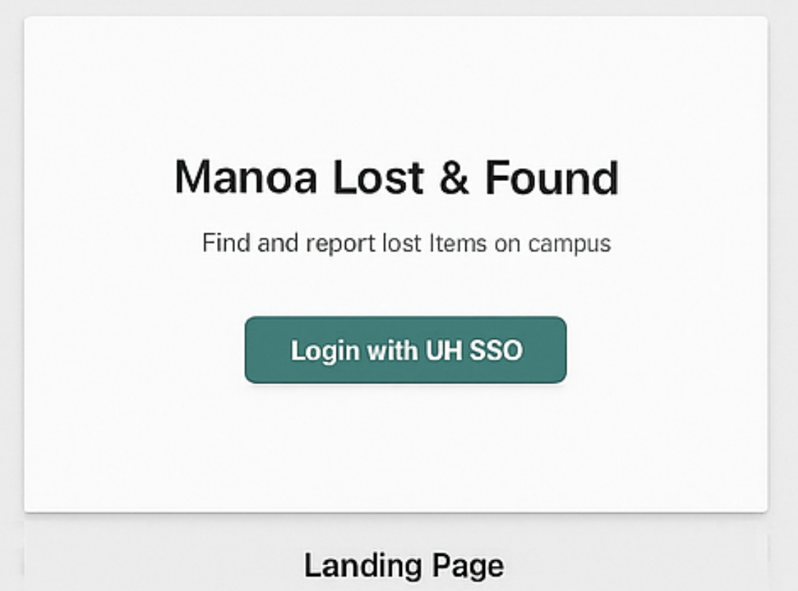
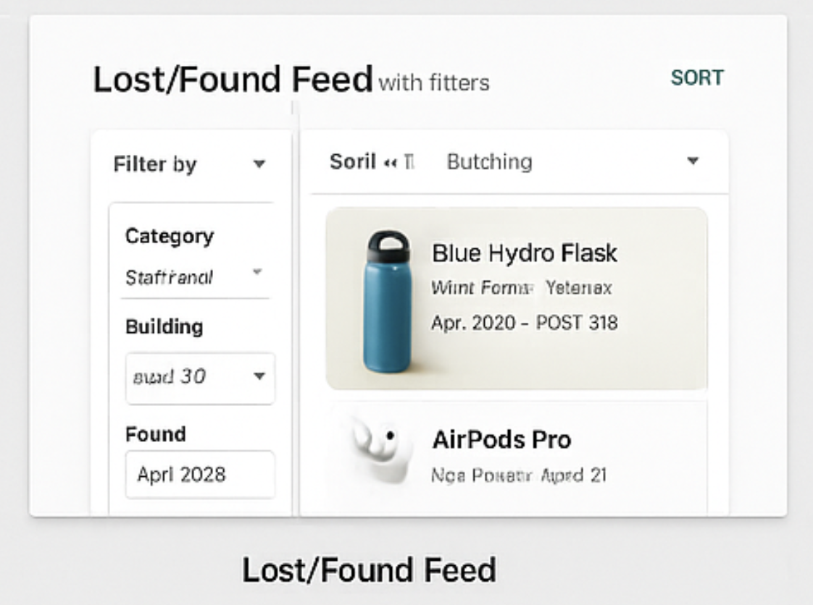
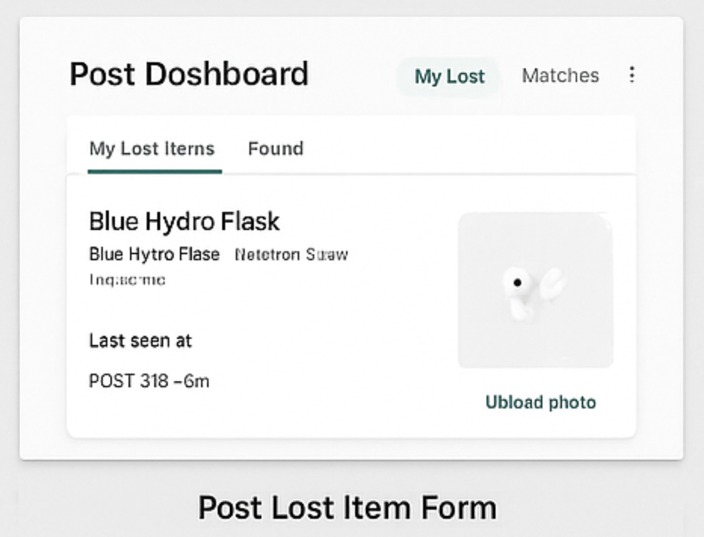
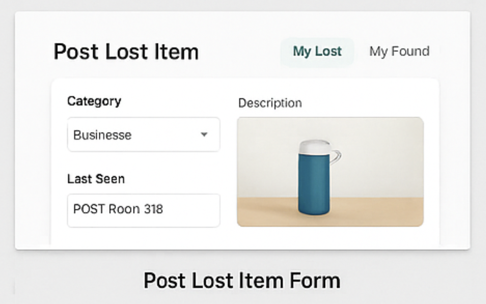
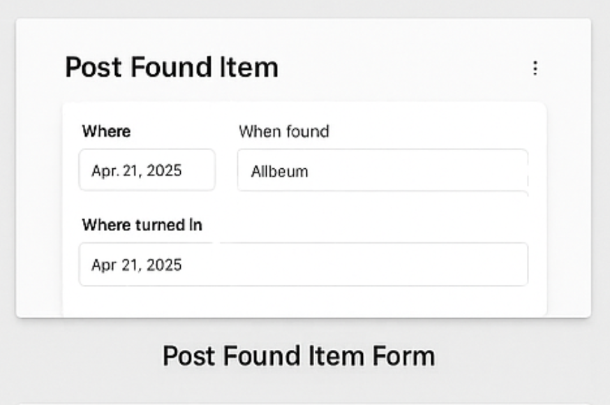
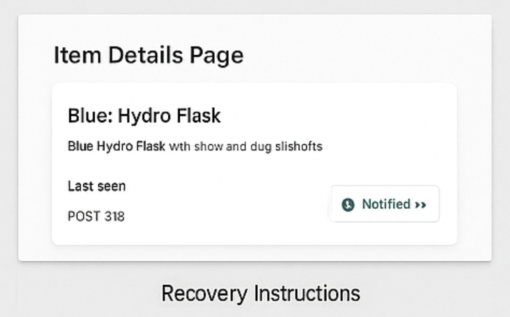
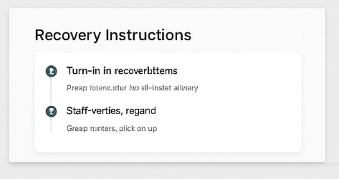
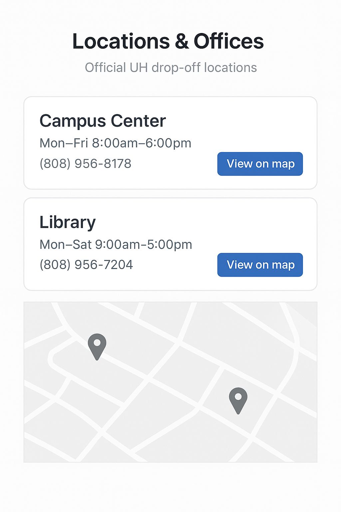

<!-- Hero / Title -->
<h1 align="center">Manoa Lost &amp; Found</h1>

<em>A UH Mānoa community app to report, browse, and recover lost items — built by students for students.</em>

  <a href="https://manoa-lost-found.github.io/manoa-lost-found/"><b>Live Site</b></a> ·
  <a href="https://github.com/manoa-lost-found/manoa-lost-found"><b>View on GitHub</b></a> ·
  <a href="https://github.com/manoa-lost-found/manoa-lost-found/issues/new"><b>Open an Issue</b></a>

  
  
  

**Proposers:** Jermaine Bruno • Michael Lau • Brandon Nguyen • Edward Uzueta • Justin Lai  
**Date:** November 12, 2025

---

## Table of Contents
- [Overview](#-overview)
- [Roles & Capabilities](#-roles--capabilities)
- [App Features (M1 Scope)](#-app-features-m1-scope)
- [User Guide (Mockup Walkthrough)](#-user-guide-mockup-walkthrough)
- [Mockups](#%EF%B8%8F-mockups)
- [Data & Status Model (Draft)](#%EF%B8%8F-data--status-model-draft)
- [Proposed Tech Stack](#-proposed-tech-stack)
- [Deployment](#-deployment)
- [Repository Structure](#-repository-structure)
- [Risks & Mitigations](#%EF%B8%8F-risks--mitigations)
- [Future Enhancements](#-future-enhancements)
- [Team](#-team)

---

## 📘 Overview

### The Problem
Each semester, UH Mānoa students lose countless items — IDs, water bottles, textbooks, AirPods, and other valuables. While the university technically has a Lost & Found system, it’s inefficient and fragmented. The current process involves emailing departments, calling offices, or physically visiting locations like Campus Center or the Library. There’s no centralized platform for checking updates, leaving students unsure if their lost items will ever be found.

### The Solution
**Manoa Lost & Found** is a centralized digital platform that unifies reporting and recovering lost items across UH Mānoa. Students and staff can:
- Post **Lost** or **Found** items with descriptions, images, and locations.
- Receive **notifications** when potential matches are found.
- Use **UH authentication** for security and campus-only access.
- Route physical returns through **official UH offices** for verified recovery.

> All item exchanges are handled through official UH offices — no private handoffs.

---

## 👥 Roles & Capabilities

### 🧑‍🎓 Users (Students & Staff)
- Create **Lost Item** reports including photo, category, description, and last-seen location/time.
- Set **alerts/preferences** (keywords, buildings, or item types).
- Access a **personal dashboard** showing “My Lost Items,” “My Found Items,” and “Matches & Alerts.”

### 🧾 Finders (Any Authenticated User)
- Post **Found Item** reports (photo, where/when found, where turned in).
- Use an in-app **“How to Turn In Items”** page listing official drop-off offices and instructions.
- Notify the rightful owner securely via UH email without direct contact.

### 🛠️ Admins (Campus Center / Library Staff)
- **Verify** items received at official drop-off points.
- Update item status (Received → Ready for Pickup → Recovered).
- **Flag duplicates**, moderate posts, and manage user roles.
- Configure **drop-off locations**, contact info, and office hours.

---

## 💡 App Features (M1 Scope)

- UH-authenticated access (campus-only)
- Tabs for **Lost** and **Found** item feeds  
- Advanced filters: category, date, building, keyword  
- Create/Edit/Delete posts with photo uploads  
- Notification system for potential matches  
- Admin verification dashboard  
- “How to Turn In Items” instructions page  
- Locations directory (Campus Center, Library, etc.)  

> M1 focuses on **design, data model, and mockups** (no backend required yet).

---

## 👣 User Guide (Mockup Walkthrough)

1. **Landing → Login (UH SSO)** → Personalized **Dashboard**.  
2. **Report Lost Item**  
   - *Category:* Bottle  
   - *Description:* Blue Hydroflask with straw and dog stickers  
   - *Last Seen:* POST Room 318  
   - *Photo:* Upload from phone  
3. Listing appears in **Lost Items** feed and **My Lost Items**.  
4. Owner receives **alerts** when matching Found posts appear.  
5. **Finder** posts a Found item, turns it in at **Campus Center**, and notifies the owner through the app.  
6. **Admin** verifies the item and updates status to **Ready for Pickup**.  
7. Owner retrieves the item; system records a successful recovery.

---

## 🖼️ Mockups
> For M1, paper-and-pencil mockups are fine. Put images in `docs/images/` and link as `images/...` below.

- **Landing Page**  
  

- **Lost/Found Feed with Filters**  
  

- **User Dashboard (My Lost / My Found / Matches)**  
  

- **Post Lost Item Form**  
  

- **Post Found Item Form**  
  

- **Item Details Page**  
  

- **Recovery Instructions**  
  

- **Admin Panel**  
  

- **Locations & Offices Directory**  
  

---

## 🗃️ Data & Status Model (Draft)

### **Item**

| Field | Type | Description |
|------|-----|-------------|
| `type` | enum(`lost`, `found`) | Whether the item is lost or found |
| `category` | string | e.g., Electronics, Books, Clothing, Bottle, Misc |
| `description` | text | Details about the item |
| `photo[]` | image | Uploaded images |
| `location` | string | Where item was last seen / where turned in |
| `status` | enum(`Open`, `Received`, `Ready for Pickup`, `Recovered`) | Progress of item |
| `timestamps` | datetime | `createdAt`, `updatedAt` |
| `ownerId` / `finderId` / `verifiedBy` | string | UH user IDs for each role |

### **Location**
- `name`, `hours`, `contact`, `mapLink`

### **AlertPreference**
- `userId`, `keywords[]`, `categories[]`, `buildings[]`

---

## 🧰 Proposed Tech Stack

| Component | Technology |
|---|---|
| **Frontend** | React (Next.js) or Meteor + React |
| **Backend** | Node.js / Express |
| **Database** | MongoDB or Firebase Firestore |
| **Auth** | UH CAS / UH OIDC (campus SSO) |
| **Storage** | Cloud bucket for images |
| **Maps** | UH Campus Map or Google Maps |
| **Notifications** | UH email + in-app alerts |

---

## 🚀 Deployment

- **Live Site:** https://manoa-lost-found.github.io/manoa-lost-found/  
- **Repository:** https://github.com/manoa-lost-found/manoa-lost-found

**GitHub Pages configuration:**
- **Source:** *Deploy from a branch*  
- **Branch:** `Project-page`  
- **Folder:** `/docs`  
- **Entrypoint:** `docs/index.md`  
- **Images:** stored under `docs/images/`, referenced as `images/...`

---

## 🧱 Repository Structure

